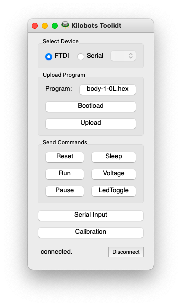
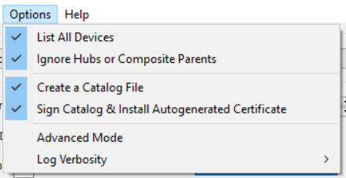
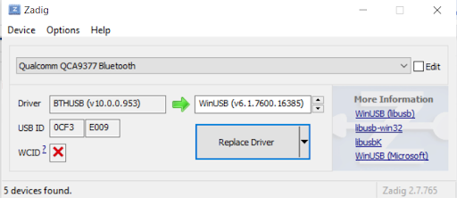
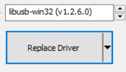
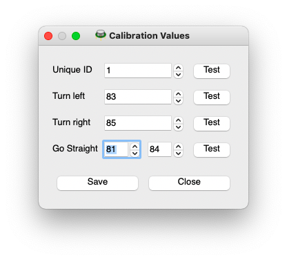

# Getting started with kilobots
---

Here is a simple guide to get started with kilobots.

---
## Turning the kilobot on and off

On the right side of the front leg are two pins. You probably also have a small red connector for those two pins. By placing the connector on the two pins, you *turn the kilobot on* and it should blink green. To *turn the kilobot off*, simply remove the connector.

!!!note
    As not to lose the connector, you can simply place it on one pin.

!!!warning
    Be sure not to place the connectors on the two pins that are on the left side of the front leg, as those pins are intended for the debugging cable.

---

## What the kilobot is made of

As you can see in the pictures above, one kilobot *mainly* has :

* 3 legs
* 2 rumble motors
* 1 LED
* a group of 2 power pins
* a group of 2 debug pins
* an IR transmitter
* an IR sensor
* a battery and a charging hook

---

## What the kilobot is up to

Kilobots were designed to be very cheap, but are therefore very limited. They can perform simple task involving small movements, basic communication and distance sensing. However, as they move using vibrations, they can't have a reliable feedback of the movement executed. This makes it impossible to know neither their position nor their orientation. The lack of a second IR sensor also makes it impossible to know the position or orientation of the nearby kilobots.

---

## Using KiloGUI

The kilobots come with a utility app to do various tasks with them, such as calibration, program transfer, debugging or execution control.

You can download KiloGUI at the download section of the [kilobotics website](https://www.kilobotics.com/download).

To use KiloGUI, you will have to place the head controller of the kilobots on top of or beside the concerned kilobots and connect it to your PC. Connection with the kilobot should be instantaneous.

---

## KILOGUI did not work ?

It’s possible that your OHC ( Over-Head Controller) is not recognized by the Kiloguide interface, so you will need to modify your driver.

Here is the procedure to follow :

* install the software [“Zadig”](https://zadig.akeo.ie/).

* Start it

* Click on the “Options” and next select “List All Deveices”

* Now Zadig sofware would be like this

* Select “LUFA AVRISP MkIIClone” and “libusb-win32 (V1.2.6.0)”

*  Click « Replace Drive» (or “Reinstall Driver” if already done once)

 or 

* Select “FT232R USB UART” and “libusb-win32 (V1.2.6.0)” 

* And that’s all ! You can now close Zadig and retry to use KILOGUI with the OHC.

If you want to see the original guide for this issue go [here](https://e-l.unifi.it/pluginfile.php/729678/mod_resource/content/1/D-%20Kilobots%20usage.pdf)

## Checking the battery of a kilobot

You can check the battery power of the kilobot by using the KiloGUI interface. Simply press the "Voltage" button and the kilobot LED should light up. The color of the LED indicates the battery power : green means "fully charged" and red means "barely charged".

---

## Charging the kilobots

The kilobots come with a charging bar where you can hang up to ten kilobots.

Connect the charger to a power supply, then turn the kilobots on and hang them to the charger. The hook of the kilobot should be hung to the upper bar and the two rear legs of the kilobot should touch the lower bar.

---

## Calibrating a kilobot

After pressing the "calibrate" button of KiloGUI, the following window should appear :

With this window, you can give each kilobot a *unique ID* and specific *calibration values*. The "test" buttons allows to see the change in the kilobot's motion.

From there you can adjust the values so that the kilobot is able to go straight and turn right and left reliably. When you're done, don't forget to save the parameters before you close the window.

---
